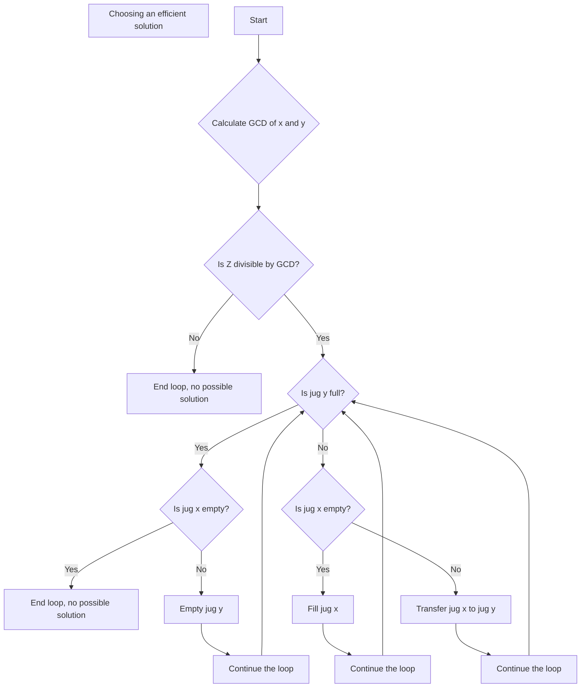

# Water Jug challenge

Exercise to solve the Water jug riddle, made with the following technologies: 

- [Node](https://nodejs.org/en)
- [Typescript](https://www.typescriptlang.org)
- [Fastify](https://fastify.dev)

## Table of Content 

- [Description](#description)
- [requirements](#requirements)
- [How to Use](#how-to-use)
- [API Examples](#api-examples)
- [Algorithm](#algorithm)

# Description 

A simple REST API that provides a algorithm to solve the water jug riddle, which consist of measuring a specific amount of water using jugs of different capacities. 

# Requirements

the only functional requirement in order to use this program is installing Nodejs (this project was develop using node 21.1.0)
- [Node](https://nodejs.org/en) 

# How To Use

**Install the project dependencies**

```sh
npm install
```

**Start the server to use the API**

```sh
npm run start
```

**Run the test units to ensure the correct operation of the program**

```sh
npm run testing
```

# API Examples

## Endpoints

main endpoint of the API

```http
POST /api/v1/water
```

**The body must follow this structure**

```json
{                    
    "x_capacity": 2, 
    "y_capacity": 10, 
    "z_amount_wanted": 4 
}
```

Good response example

```json
{
  "message": "Water jug problem solved",
  "solution": {
    "steps": [
      {
        "step": 1,
        "bucketX": 2,
        "bucketY": 0,
        "action": "Fill X with 2L"
      },
      {
        "step": 2,
        "bucketX": 0,
        "bucketY": 2,
        "action": "Transfer from X to Y"
      },
      {
        "step": 3,
        "bucketX": 2,
        "bucketY": 2,
        "action": "Fill X with 2L"
      },
      {
        "step": 4,
        "bucketX": 0,
        "bucketY": 4,
        "action": "Transfer from X to Y"
      }
    ],
    "totalSteps": 4
  }
}
```

In case of not following the recommended body structure, the user will get one of the following bad responses from the server

**in case of not sending 1 of the 3 parameters**
```json
{
  "statusCode": 400,
  "code": "FST_ERR_VALIDATION",
  "error": "Bad Request",
  "message": "body y_capacity is a required field."
}
```

**in case of sending a parameter as a negative number**
```json
{
  "statusCode": 400,
  "code": "FST_ERR_VALIDATION",
  "error": "Bad Request",
  "message": "body/x_capacity x_capacity must be a positive number."
}
```
**in case of sending a letter/invalid character instead of a positive number**

```json
{
  "statusCode": 400,
  "code": "FST_ERR_VALIDATION",
  "error": "Bad Request",
  "message": "body/z_amount_wanted z_amount_wanted must be a number."
}
```
(for more information about the endpoint and body structure please refer to the API documentation)
# Algorithm

To create an algorithm that solves this riddle, it was first necessary to analyze the fundamentals of the problem. The Water Jug riddle is a logical puzzle where you are given two jugs with maximum capacities of x and y units of water. The goal is to measure exactly z units of water by performing only three possible actions: filling a jug, transferring water between jugs, and emptying a jug.

So for example, we have these data as an input:
X: 2
Y: 10
Z: 4

We could start with filling the jug Y first and the transfering its content to the jug Y like this

| Jug x | Jug y | Action |
| ---- | ---- | ---- |
|2|0|We fill the jug x|
|0|2|We Transfer from  the jug x to the jug y|
|2|2|We Fill again the jug x|
|0|4|We Transfer from Jug x to Jug y //we finish the riddle|

As we can see, using only these operations we could find the solution to the water jug riddle with the given inputs, we could also start filling the Jug y , because we can start filling any Jug we want, but give this case would prove to be a worst solution. An example where filling the Jug y would result in a better solution can be appreciated with these data input:

X: 4
Y: 3
Z: 2

| Jug x | Jug y | Action |
| ---- | ---- | ---- |
|0|3|We fill the jug y|
|3|0|We Transfer from  the jug y to the jug x|
|3|3|We Fill again the jug y|
|4|2|We Transfer from Jug y to Jug x //we finish the riddle|

In this case we fill first the Jug Y cause that will bring us to the best possible solution, as demonstrated.

We can start now to see some patterns in these previous examples:
- All 3 number must be positives in order to be a possible solution
- We will always start with both jugs empty
- We will always have to fill either jug X or Y
- **The Z value must be divisible by the Greatest Common Divisor of X and Y**

this last point is one of the most important, cause this one will decide if the input data will have a possible solution or not. In other words, for it to be possible to measure exactly Z units of water, Z must be divisible by the GCD of X and Y.

for example, Consider the following jug capacities and target amount:

X: 4
Y: 6
Z: 4

Before we start doing the riddle itself we will do a little math calculating the GCD of `X` and `Y`:

- GCD(4,6) = 2

Now we check if `Z` is divisible by the GCD: 

- 4/2 = 2

Since 4 is divisible by 2, it is possible to measure 4 units of water with jugs of 4 and 6 units.

| Jug x | Jug y | Action |
| ---- | ---- | ---- |
|4|0|We fill the jug x //we finish the riddle|

but to these hypothesis, we could try a different input data

X: 8
Y: 2 
Z: 3

given this data if we calculate the GCD of `Y` and `X`:

GCD(8,2) = 2

but since 3 is not divisible by 2 (we get a decimal number instead of a whole), this specific riddle doesn't have a possible solution, but just in case we can test it out:

| Jug x | Jug y | Action |
| ---- | ---- | ---- |
|8|0|We fill the jug x |
|6|2|We Transfer from the jug y to the jug x |
|6|0|We Empty the jug Y |
|4|2|We Transfer from the jug y to the jug x |
|4|0|We Empty the jug Y |
|2|2|We Transfer from the jug y to the jug x |
|2|0|We Empty the jug Y |
|0|2|We Transfer from the jug y to the jug x |
|0|0|We Empty the jug Y |

As we can see from the table, it is impossible to measure 3, neither jug ends up with the exact desired amount. This confirms that, with the given capacities, it is not possible to measure exactly 3 units of water.

## Creation of the solution

now that we know how to riddle works, what are his rules and conditions and our possible actions. We can start to work in our approach to the solution, which will derivate from our 3 main actions: Fill, Transfer and Emptying. 

**Solution 1: Filling X First.**


**Solution 2: Filling Y First.**

Since it is possible to find 2 solutions to the same riddle (if it has a possible solution), we calculate both results, compare them and select the one with less steps to find the most optimal solution.
